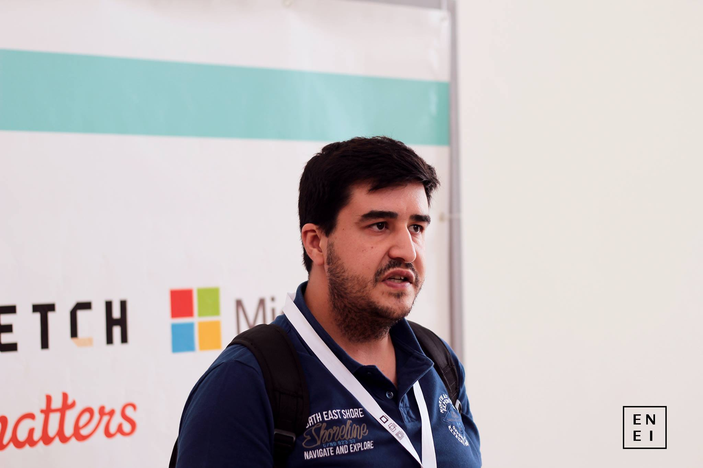

# Professors i

::: columns

:::: column
- **Name:** Mário Antunes
- **E-Mail:** [mario.antunes@ua.pt](mailto:mario.antunes@ua.pt)
- **Office:** 19.2.15 (IT1)
::::

:::: column

::::

:::

# Professors ii

::: columns

:::: column
- **Name:** Óscar Pereira
- **E-Mail:** [omp@ua.pt](mailto:omp@ua.pt)
- **Office:** 19.1.24 (IT1)
::::

:::: column

::::

:::

# Class Introduction

Covering the following topics:

* C1. Virtualization and Containers
* C2. WEB Servers
* C3. Communication between Applications
* C4. Communication in IP networks
* C5. Representation and Communication of Digital Information
* C6. Relational Databases and SQL

# Grading

- 50% Theory + 50% Practice
- *Discrete:* 25% Project 1 + 25% Project 2 + 50% Exam
- *Final:* 50% Final Exame + 50% Project

# Class Schedule i

\begin{table}
\centering
\begin{tabular}{lllll}
\toprule
P1/P2 & P3/P5 & P4 & P6 & Topics \\
\midrule
12-02-2026 & 10-02-2026 & 11-02-2026 & 09-02-2026 & C0 \\
19-02-2026 & 24-02-2026 & 18-02-2026 & 16-02-2026 & C0 \\
26-02-2026 & 03-03-2026 & 25-02-2026 & 23-02-2026 & C1 \\
05-03-2026 & 10-03-2026 & 04-03-2026 & 02-03-2026 & C1 \\
12-03-2026 & 17-03-2026 & 11-03-2026 & 09-03-2026 & C2 \\
19-03-2026 & 24-03-2026 & 18-03-2026 & 16-03-2026 & C2 \\
26-03-2026 & 31-03-2026 & 25-03-2026 & 23-03-2026 & C3 \\
\bottomrule
\end{tabular}
\end{table}

# Class Schedule ii

\begin{table}
\centering
\begin{tabular}{lllll}
\toprule
P1/P2 & P3/P5 & P4 & P6 & Topics \\
\midrule
16-04-2026 & 14-04-2026 & 15-04-2026 & 30-03-2026 & C4 \\
23-04-2026 & 21-04-2026 & 22-04-2026 & 13-04-2026 & C4 \\
07-05-2026 & 05-05-2026 & 06-05-2026 & 20-04-2026 & C5 \\
14-05-2026 & 12-05-2026 & 13-05-2026 & 04-05-2026 & C5 \\
21-05-2026 & 19-05-2026 & 20-05-2026 & 11-05-2026 & C6 \\
28-05-2026 & 26-05-2026 & 27-05-2026 & 18-05-2026 & C6 \\
           & 02-06-2026 & 03-06-2026 & 25-05-2026 & Proj \\
           &            &            & 01-06-2026 & Proj \\
\bottomrule
\end{tabular}
\end{table}

# Bibliography i

- James F. Kurose and Keith W. Ross. 2021. Computer Networking: A Top-Down Approach (8th edition). Pearson.
- Python Networking 101: Navigating essentials of networking, socket programming, AsyncIO, network testing, simulations and Ansible, Odette Windows, GiftforGits, 2023
- Mailund, Thomas 2019 Introducing Markdown and Pandoc: Using Markup Language and Document Converter
- William Shotts 2019 The Linux Command Line, 2nd Edition - A Complete Introduction

# Bibliography ii

- Paul McFedries 2023 HTML, CSS, & JavaScript All-in-One For Dummies
- Tanenbaum, A. S., & Wetherall, D. J. (2011). *Computer Networks* (5th Edition). Pearson.
- Silberschatz, A., Korth, H. F., & Sudarshan, S. (2019). *Database System Concepts* (7th Edition). McGraw-Hill.
- Kurose, J. F., & Ross, K. W. (2021). *Computer Networking: A Top-Down Approach* (8th Edition). Pearson.
