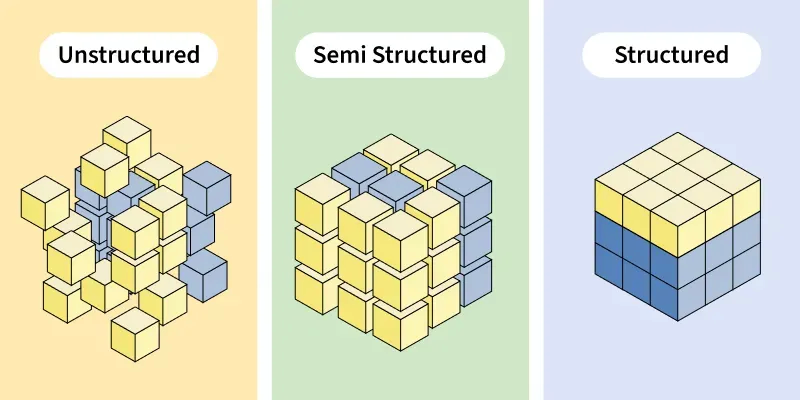

# Introduction

## The Role of Data in Engineering I

As engineers, we deal with data in almost every task.

* **Sensor Readings:** Temperature, pressure, location.
* **Configurations:** How a system should behave.
* **Logs:** What happened in the past.
* **Communication:** Sending messages between services.
* **Storage:** Saving state for later use.

## The Role of Data in Engineering II

The quality of our systems depends on how we represent this data.

* **Efficiency:** Minimizing storage and bandwidth.
* **Reliability:** Ensuring data is not corrupted.
* **Interoperability:** Allowing different systems to "talk" to each other.
* **Maintainability:** Making it easy for humans to understand and change.

## Data vs. Information I

It is important to distinguish between these two concepts.

* **Data:** Raw facts, symbols, or signals without context (e.g., `[25, 26, 25, 24]`).
* **Information:** Data that has been processed, organized, or structured to be meaningful (e.g., "The average temperature in the room was 25°C").

## Data vs. Information II

* Data is the input; Information is the output.
* Information requires **context**.
* Without a schema or metadata, data is just a collection of bits.
* In this class, we focus on how to transform raw bits into structured information.

## The DIKW Pyramid

A model to represent the structural and functional relationships between data and wisdom.

* **Data:** The foundation (symbols).
* **Information:** Linked data (answers who, what, where, when).
* **Knowledge:** Applied information (answers how).
* **Wisdom:** Evaluated knowledge (answers why).

---

\begin{center}
\begin{tikzpicture}[scale=0.45, transform shape]
    \begin{scope}
        % Base Lines
        \draw[very thick, MyTriangle!40] (0,-0.03) -- (15,-0.03);
        \draw[very thick, MyTriangle!55] (0,-3) -- (15,-3);
        \draw[very thick, MyTriangle!70] (0,-6) -- (15,-6);
        \draw[very thick, MyTriangle!85] (0,-9) -- (15,-9);
        \draw[very thick, MyTriangle] (0,-11.95) -- (15,-11.95);
        \draw[very thick, MyTriangle] (15,-0.02) -- (15,-11.96);

        % Triangles (with cycle)
        \draw[very thick,white,fill=MyTriangle!55] (0,0) -- (-8,-12) -- (8,-12) -- cycle;
        \filldraw[very thick,white,fill=MyTriangle!70] (0,0) -- (-6,-9) -- (6,-9) -- cycle;
        \filldraw[very thick,white,fill=MyTriangle!85] (0,0) -- (-4,-6) -- (4,-6) -- cycle;
        \filldraw[very thick,white,fill=MyTriangle] (0,0) -- (-2,-3) -- (2,-3) -- cycle;

        % Pyramid Labels
        \node at (0,-2) {\bfseries\sffamily\Large Wisdom};
        \node at (0,-4.5) {\bfseries\sffamily\Large Knowledge};
        \node at (0,-7.5) {\bfseries\sffamily\Large Information};
        \node at (0,-10.5) {\bfseries\sffamily\Large Data};

        % Definitions
        \node[text width=8cm, anchor=west] at (3,-2) {\large $\bullet$ understanding, integrated, actionable};
        \node[text width=8cm, anchor=west] at (4.5,-4.5) {\large $\bullet$ contextual, synthesized, learning};
        \node[text width=8cm, anchor=west] at (6.5,-7.5) {\large $\bullet$ useful, organized, structured};
        \node[text width=8cm, anchor=west] at (8.5,-10.5) {\large $\bullet$ signals, know nothing};
    \end{scope}

    % Arrows & Labels
    \begin{scope}[xshift=-3.7cm,yshift=-3cm]
        \draw[-{Triangle[width=14pt,length=10pt]}, line width=6pt, rounded corners=15pt, MyArrow, line cap=round, line join=round] (0,0) -- (0,1.2) -- (2,1.2);
        \node[anchor=east, align=right] at (-0.3,0.6) {\large given insight,\\becomes};
    \end{scope}
    \begin{scope}[xshift=-5.7cm,yshift=-5.5cm]
        \draw[-{Triangle[width=14pt,length=10pt]}, line width=6pt, rounded corners=15pt, MyArrow, line cap=round, line join=round] (0,0) -- (0,1.2) -- (2,1.2);
        \node[anchor=east, align=right] at (-0.3,0.6) {\large given meaning,\\becomes};
    \end{scope}
    \begin{scope}[xshift=-7.7cm,yshift=-8.5cm]
        \draw[-{Triangle[width=14pt,length=10pt]}, line width=6pt, rounded corners=15pt, MyArrow, line cap=round, line join=round] (0,0) -- (0,1.2) -- (2,1.2);
        \node[anchor=east, align=right] at (-0.3,0.6) {\large given context,\\becomes};
    \end{scope}
\end{tikzpicture}
\end{center}

# Digital Representation

## Bits and Bytes I

At the lowest level, all digital information is binary.

* **Bit:** The smallest unit of information (0 or 1).
* **Byte:** A group of 8 bits.
* **Capacity:** A byte can represent $2^8 = 256$ different values.
* **Hexadecimal:** A more human-friendly way to write bytes (e.g., `0xFF`).

## Bits and Bytes II

How do we represent numbers?

* **Integers:** Fixed-point representation (e.g., 2's complement).
* **Floats:** Floating-point representation (IEEE 754).
* **Endianness:** The order of bytes in memory (Big-Endian vs. Little-Endian).
* **Network Order:** Usually Big-Endian.

## Character Encoding I: ASCII

How do we represent text?

* **ASCII (1963):** American Standard Code for Information Interchange.
* **Limit:** 7 bits (128 characters).
* **Coverage:** English alphabet, numbers, and basic symbols.
* **Problem:** No support for accented characters (á, ç), Greek letters, or Emojis.

## Character Encoding II: Unicode

The solution to the "Babel" of encodings.

* **Goal:** A single standard for every character in every language.
* **Code Points:** Each character is assigned a unique number (e.g., `U+0041` for 'A').
* **Size:** Supports over 1 million characters.

## Character Encoding III: UTF-8

The most popular encoding for the web and modern systems.

* **Variable Length:** Uses 1 to 4 bytes per character.
* **Backward Compatible:** The first 128 characters are identical to ASCII.
* **Efficiency:** English text takes 1 byte per char; more complex scripts take more.
* **Standard:** Should be the default choice for all engineering projects.

# Data Hierarchy

## Classification of Data I

Data is generally classified into three categories based on its structure:

1. **Unstructured Data:** No predefined format.
2. **Semi-Structured Data:** Has some organizational properties but no strict schema.
3. **Structured Data:** Follows a strict, predefined model (usually tabular).

## Classification of Data II

Understanding how data is organized is the first step in the pipeline.

* **Unstructured:** Text, Binary, Media.
* **Semi-Structured:** Hierarchical trees or Key-Value pairs (JSON, XML).
* **Structured:** Tabular (Rows and Columns).

## Illustration of Structure

{ width=256px }

---

{ width=256px }

# Unstructured Data

## Plain Text vs. Binary

How is the data stored on disk?

* **Text Files:** Human-readable sequences of characters. Debuggable and portable.
* **Binary Files:** Sequences of bytes for machine reading. Compact and fast.
* **Magic Numbers:** First bytes identifying the format (e.g., `0x89 0x50 0x4E 0x47` for PNG).

## Processing Unstructured Data: Basic Tools

Before using advanced tools, we use basic Unix utilities to explore text:

* `head` / `tail`: View the beginning or end of a file.
* `wc`: Count lines, words, and characters.
* `file`: Identify the type of data.
* `grep`: Search for patterns.

## Regular Expressions (Regex) I

To process unstructured text, we need a way to describe patterns.

* **Literal:** `abc` matches "abc".
* **Wildcard:** `.` matches any character.
* **Quantifiers:** `*` (0+), `+` (1+), `?` (0 or 1).
* **Character Classes:** `[a-z]`, `\d` (digit), `\w` (word), `\s` (whitespace).

## Regular Expressions (Regex) II

* **Anchors:** `^` (start), `$` (end).
* **Example (Email):** `^[a-zA-Z0-9._%+-]+@[a-zA-Z0-9.-]+\.[a-zA-Z]{2,}$`

## Processing Logs: `awk` and `sed`

Logs are "mostly" unstructured text.

* **`awk`:** Process columns of text.
  * Example: `awk '$9 == 404 {print $7}' access.log`
* **`sed`:** Stream editor for transformation.
  * Example: `sed 's/old/new/g' file.txt`

## Media Formats: Images and Documents

Representing visual and complex information.

* **Raster:** Grid of pixels (PNG, JPEG). Lossy vs. Lossless.
* **Vector:** Mathematical paths (SVG, PDF). Infinitely scalable.
* **PDF:** Container for text, fonts, and graphics. Includes **Metadata** (Author, Date).

# Semi-Structured Data

## Characteristics

Data that uses "tags" or "markers" to separate semantic elements.

* **Flexibility:** Represents hierarchy and nesting.
* **Formats:** CSV, XML, JSON, YAML.

## CSV (Comma Separated Values)

The simplest way to exchange tabular data as text.

* **Concept:** Each line is a record; fields are separated by a delimiter (`,`, `;`, or tab).
* **Pros:** Universally supported, lightweight.
* **Cons:** No types, no nesting, quoting issues (fields with delimiters must be `"quoted"`).

## XML (eXtensible Markup Language)

An older, robust standard using nested tags.

* **Pros:** Supports complex schemas (XSD) and namespaces.
* **Cons:** Verbose, tag bloat, slower to parse.
* **Example:** `<user id="1"><name>mario</name></user>`

## JSON (JavaScript Object Notation)

The king of modern web communication (APIs).

* **Types:** Objects `{}`, Arrays `[]`, Strings, Numbers, Booleans, Null.
* **Pros:** Smaller than XML, native to Python Dictionaries and Lists.
* **Validation:** Use **JSON Schema** to define rules.

## YAML (YAML Ain't Markup Language)

The standard for configuration and DevOps.

* **Syntax:** Relies on indentation instead of brackets.
* **Features:** Supports comments `#`, anchors, and multi-line strings.
* **Usage:** Docker, Kubernetes, GitHub Actions.

# Multi-Format Comparison

## Employee Record: CSV

No native nesting. "Skills" list requires a custom separator (e.g., pipe `|`).

```csv
id,name,skills,active
1,"Jane Doe","Python|SQL",true
2,"Bob Smith","Java|C++",false
```

## Employee Record: XML

```xml
<employees>
    <employee id="1">
        <name>Jane Doe</name>
        <skills><skill>Python</skill><skill>SQL</skill></skills>
        <active>true</active>
    </employee>
</employees>
```

## Employee Record: JSON

```json
{"employees": [{
      "id": 1, "name": "Jane Doe",
      "skills": ["Python", "SQL"], "active": true
    }]
}
```

## Employee Record: YAML

```yaml
employees:
  - id: 1
    name: Jane Doe
    skills: [Python, SQL]
    active: true
```

# Binary Serialization

## Efficiency over Readability

When performance is more important than human readability.

* **BSON:** Binary JSON (used in MongoDB). Supports more types (e.g., Date).
* **MessagePack:** Small, fast binary serialization.
* **Parquet:** Columnar storage format. Efficient for big data analytics.

## Protocol Buffers (Protobuf)

Google's serialization format.

1.  **Define:** Structure in a `.proto` file.
2.  **Compile:** Generate code for your language.
3.  **Serialize:** Highly compact binary data for transmission.

# Tools and Validation

## Working with Data: `jq` and `yq`

Command-line tools for processing JSON and YAML.

* **`jq`:** `cat data.json | jq '.user'`
* **`yq`:** `yq eval '.port = 8080' config.yml`

## Data Validation with Pydantic

**Pydantic** is the modern way to validate data in Python.

```python
from pydantic import BaseModel, EmailStr

class User(BaseModel):
    id: int
    name: str
    email: EmailStr

# Validates and converts types automatically
u = User(id="1", name="Mario", email="mario@ua.pt")
```

# Summary

## Summary

* **Categories:** Unstructured (logs), Semi-structured (JSON/YAML), Structured (CSV).
* **Fundamentals:** Understand bits, bytes, and character encodings (UTF-8).
* **Processing:** Use Regex, `awk`, and `sed` for text; `jq`/`yq` for formats.
* **Choice:** Use JSON for APIs, YAML for config, and CSV/Parquet for bulk data.
* **Validation:** Always validate data (e.g., Pydantic) to ensure system integrity.
