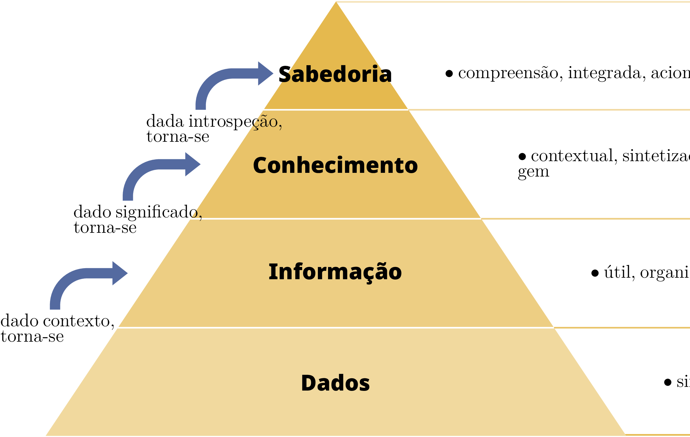

# Introdução

## O Papel dos Dados na Engenharia I

Como engenheiros, lidamos com dados em quase todas as tarefas.

* **Leituras de Sensores:** Temperatura, pressão, localização.
* **Configurações:** Como um sistema deve comportar-se.
* **Logs:** O que aconteceu no passado.
* **Comunicação:** Envio de mensagens entre serviços.
* **Armazenamento:** Guardar o estado para uso posterior.

## O Papel dos Dados na Engenharia II

A qualidade dos nossos sistemas depende de como representamos estes dados.

* **Eficiência:** Minimizar armazenamento e largura de banda.
* **Fiabilidade:** Garantir que os dados não são corrompidos.
* **Interoperabilidade:** Permitir que diferentes sistemas "falem" entre si.
* **Manutenibilidade:** Facilitar a compreensão e alteração por humanos.

## Dados vs. Informação I

É importante distinguir entre estes dois conceitos.

* **Dados:** Factos brutos, símbolos ou sinais sem contexto (ex: `[25, 26, 25, 24]`).
* **Informação:** Dados que foram processados, organizados ou estruturados para terem significado (ex: "A temperatura média na sala foi de 25°C").

## Dados vs. Informação II

* Dados são a entrada; Informação é a saída.
* Informação requer **contexto**.
* Sem um esquema ou metadados, os dados são apenas uma coleção de bits.
* Nesta aula, focamo-nos em como transformar bits brutos em informação estruturada.

## A Pirâmide DIKW

Um modelo para representar as relações estruturais e funcionais entre dados e sabedoria.

* **Dados (Data):** A base (símbolos).
* **Informação (Information):** Dados ligados (responde a quem, quê, onde, quando).
* **Conhecimento (Knowledge):** Informação aplicada (responde a como).
* **Sabedoria (Wisdom):** Conhecimento avaliado (responde a porquê).

---

{ width=512px }

# Representação Digital

## Bits e Bytes I

Ao nível mais baixo, toda a informação digital é binária.

* **Bit:** A menor unidade de informação (0 ou 1).
* **Byte:** Um grupo de 8 bits.
* **Capacidade:** Um byte pode representar $2^8 = 256$ valores diferentes.
* **Hexadecimal:** Uma forma mais amigável para humanos escreverem bytes (ex: `0xFF`).

## Bits e Bytes II

Como representamos números?

* **Inteiros:** Representação de vírgula fixa (ex: complemento para 2).
* **Reais (Floats):** Representação de vírgula flutuante (IEEE 754).
* **Endianness:** A ordem dos bytes na memória (Big-Endian vs. Little-Endian).
* **Network Order:** Geralmente Big-Endian.

## Codificação de Caracteres I: ASCII

Como representamos texto?

* **ASCII (1963):** American Standard Code for Information Interchange.
* **Limite:** 7 bits (128 caracteres).
* **Cobertura:** Alfabeto inglês, números e símbolos básicos.
* **Problema:** Sem suporte para caracteres acentuados (á, ç), letras gregas ou Emojis.

## Codificação de Caracteres II: Unicode

A solução para a "Babel" de codificações.

* **Objetivo:** Um padrão único para cada caracter em cada língua.
* **Code Points:** Cada caracter tem um número único atribuído (ex: `U+0041` para 'A').
* **Tamanho:** Suporta mais de 1 milhão de caracteres.

## Codificação de Caracteres III: UTF-8

A codificação mais popular para a web e sistemas modernos.

* **Comprimento Variável:** Usa 1 a 4 bytes por caracter.
* **Retrocompatível:** Os primeiros 128 caracteres são idênticos ao ASCII.
* **Eficiência:** Texto em inglês ocupa 1 byte por char; scripts complexos ocupam mais.
* **Padrão:** Deve ser a escolha por defeito em projetos de engenharia.

# Hierarquia de Dados

## Classificação de Dados I

Os dados são geralmente classificados em três categorias com base na sua estrutura:

1. **Dados Não Estruturados:** Sem formato predefinido.
2. **Dados Semi-Estruturados:** Têm propriedades organizacionais mas sem esquema rígido.
3. **Dados Estruturados:** Seguem um modelo estrito e predefinido (geralmente tabular).

## Classificação de Dados II

Compreender como os dados estão organizados é o primeiro passo.

* **Não Estruturados:** Texto, Binário, Multimédia.
* **Semi-Estruturados:** Árvores hierárquicas ou pares Chave-Valor (JSON, XML).
* **Estruturados:** Tabulares (Linhas e Colunas).

## Ilustração da Estrutura

{ width=256px }

---

{ width=256px }

# Dados Não Estruturados

## Texto Simples vs. Binário

Como é que os dados são guardados no disco?

* **Ficheiros de Texto:** Sequências de caracteres legíveis por humanos. Depuráveis e portáteis.
* **Ficheiros Binários:** Sequências de bytes para leitura por máquina. Compactos e rápidos.
* **Magic Numbers:** Primeiros bytes que identificam o formato (ex: `0x89 0x50 0x4E 0x47` para PNG).

## Processamento de Dados Não Estruturados: Ferramentas Básicas

Antes de usar ferramentas avançadas, usamos utilitários Unix básicos:

* `head` / `tail`: Ver o início ou fim de um ficheiro.
* `wc`: Contar linhas, palavras e caracteres.
* `file`: Identificar o tipo de dados.
* `grep`: Procurar padrões.

## Expressões Regulares (Regex) I

Para processar texto não estruturado, precisamos de descrever padrões.

* **Literal:** `abc` corresponde a "abc".
* **Wildcard:** `.` corresponde a qualquer caracter.
* **Quantificadores:** `*` (0+), `+` (1+), `?` (0 ou 1).
* **Classes de Caracteres:** `[a-z]`, `\d` (dígito), `\w` (palavra), `\s` (espaço).

## Expressões Regulares (Regex) II

* **Âncoras:** `^` (início), `$` (fim).
* **Exemplo (Email):** `^[a-zA-Z0-9._%+-]+@[a-zA-Z0-9.-]+\.[a-zA-Z]{2,}$`

## Processamento de Logs: `awk` e `sed`

Logs são texto "quase" não estruturado.

* **`awk`:** Processar colunas de texto.
  * Exemplo: `awk '$9 == 404 {print $7}' access.log`
* **`sed`:** Editor de fluxo para transformação.
  * Exemplo: `sed 's/velho/novo/g' ficheiro.txt`

## Formatos Multimédia: Imagens e Documentos

Representação de informação visual e complexa.

* **Raster:** Grelha de píxeis (PNG, JPEG). Com perdas vs. Sem perdas.
* **Vectorial:** Caminhos matemáticos (SVG, PDF). Infinitamente escalável.
* **PDF:** Contentor para texto, fontes e gráficos. Inclui **Metadados** (Autor, Data).

# Dados Semi-Estruturados

## Características

Dados que usam "tags" ou "marcadores" para separar elementos semânticos.

* **Flexibilidade:** Representa hierarquia e aninhamento.
* **Formatos:** CSV, XML, JSON, YAML.

## CSV (Comma Separated Values)

A forma mais simples de trocar dados tabulares como texto.

* **Conceito:** Cada linha é um registo; campos separados por um delimitador (`,`, `;` ou tab).
* **Prós:** Suporte universal, leve.
* **Contras:** Sem tipos, sem aninhamento, problemas com aspas (campos com delimitadores devem estar `"entre aspas"`).

## XML (eXtensible Markup Language)

Um padrão antigo e robusto que usa tags aninhadas.

* **Prós:** Suporta esquemas complexos (XSD) e namespaces.
* **Contras:** Verboso, excesso de tags, mais lento a processar.
* **Exemplo:** `<user id="1"><name>mario</name></user>`

## JSON (JavaScript Object Notation)

O rei da comunicação web moderna (APIs).

* **Tipos:** Objetos `{}`, Arrays `[]`, Strings, Números, Booleanos, Null.
* **Prós:** Menor que o XML, nativo para Dicionários e Listas em Python.
* **Validação:** Use **JSON Schema** para definir regras.

## YAML (YAML Ain't Markup Language)

O padrão para configuração e DevOps.

* **Sintaxe:** Baseia-se na indentação em vez de parênteses ou tags.
* **Funcionalidades:** Suporta comentários `#`, âncoras e strings multi-linha.
* **Uso:** Docker, Kubernetes, GitHub Actions.

# Comparação Multi-formato

## Registo de Empregado: CSV

Sem aninhamento nativo. Lista de "Skills" requer um separador (ex: pipe `|`).

```csv
id,nome,skills,ativo
1,"Jane Doe","Python|SQL",true
2,"Bob Smith","Java|C++",false
```

## Registo de Empregado: XML

```xml
<employees>
    <employee id="1">
        <name>Jane Doe</name>
        <skills><skill>Python</skill><skill>SQL</skill></skills>
        <active>true</active>
    </employee>
</employees>
```

## Registo de Empregado: JSON

```json
{"employees": [{
      "id": 1, "name": "Jane Doe",
      "skills": ["Python", "SQL"], "active": true
    }]
}
```

## Registo de Empregado: YAML

```yaml
employees:
  - id: 1
    name: Jane Doe
    skills: [Python, SQL]
    active: true
```

# Serialização Binária

## Eficiência sobre Legibilidade

Quando o desempenho é mais importante que a legibilidade humana.

* **BSON:** JSON Binário (usado em MongoDB). Suporta mais tipos (ex: Data).
* **MessagePack:** Serialização binária pequena e rápida.
* **Parquet:** Formato de armazenamento colunar. Eficiente para análise de big data.

## Protocol Buffers (Protobuf)

Formato de serialização da Google.

1.  **Definir:** Estrutura num ficheiro `.proto`.
2.  **Compilar:** Gerar código para a sua linguagem.
3.  **Serializar:** Dados binários altamente compactos para transmissão.

# Ferramentas e Validação

## Trabalhar com Dados: `jq` e `yq`

Ferramentas de linha de comando para processar JSON e YAML.

* **`jq`:** `cat data.json | jq '.user'`
* **`yq`:** `yq eval '.port = 8080' config.yml`

## Validação de Dados com Pydantic

**Pydantic** é a forma moderna de validar dados em Python.

```python
from pydantic import BaseModel, EmailStr

class User(BaseModel):
    id: int
    name: str
    email: EmailStr

# Valida e converte tipos automaticamente
u = User(id="1", name="Mario", email="mario@ua.pt")
```

# Sumário

## Sumário

* **Categorias:** Não estruturados (logs), Semi-estruturados (JSON/YAML), Estruturados (CSV).
* **Fundamentos:** Compreender bits, bytes e codificações de caracteres (UTF-8).
* **Processamento:** Usar Regex, `awk` e `sed` para texto; `jq`/`yq` para formatos.
* **Escolha:** Usar JSON para APIs, YAML para config e CSV/Parquet para dados em massa.
* **Validação:** Validar sempre os dados (ex: Pydantic) para garantir a integridade do sistema.
