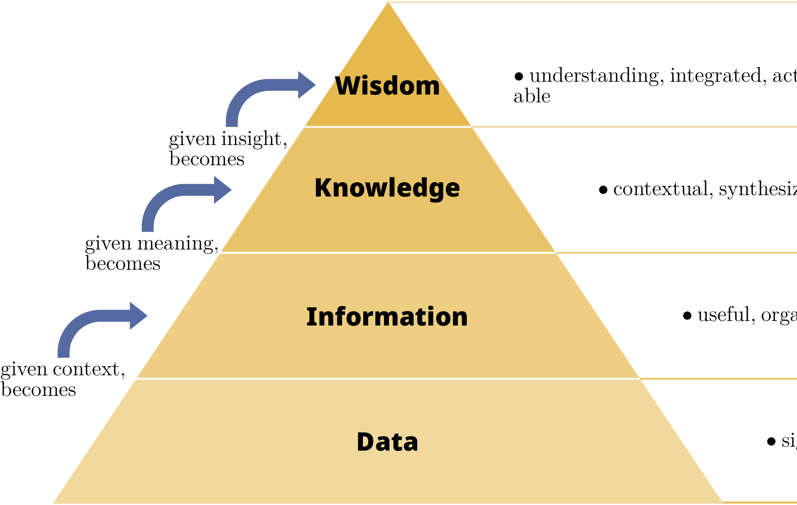

# From Data to Knowledge

## The journey from raw data to actionable knowledge.

* **Data:** Discrete, objective facts or observations.
* **Information:** Data that is processed to be useful; answers "Who, What, Where, When".
* **Knowledge:** Application of data and information; answers "How".
* **Wisdom:** Evaluated understanding; answers "Why".

## The DIKW Pyramid

{ width=512px }

* As we move up the pyramid, the **meaning** and **value** increase.
* As engineers, we build systems that automate this transformation.

## The Data Science Pipeline I

A standard workflow for taking advantage of data.

1.  **Collection:** Gathering data from sensors, APIs, or databases.
2.  **Cleaning:** Handling missing values, noise, and outliers.
3.  **Exploration (EDA):** Understanding the statistical properties of the data.
4.  **Analysis:** Building models or performing complex queries.
5.  **Visualization:** Communicating the results effectively.

## The Data Science Pipeline II

* **Iteration:** The pipeline is not linear; you often go back to cleaning after exploration.
* **Automation:** Use scripts (Python) and pipelines to make this repeatable.
* **Quality:** "Garbage in, garbage out" – the cleaning phase is the most critical.

# Data Loading & Manipulation

## The DataFrame Concept I

A DataFrame is the central data structure in modern data science.

* **Conceptual Model:** An in-memory spreadsheet or SQL table.
* **Axis 0:** Rows (Samples/Observations).
* **Axis 1:** Columns (Variables/Features).
* **Index:** Unique labels for identifying rows.

## The DataFrame Concept II

* **Homogeneity:** Each column usually contains a single data type (Int, Float, String).
* **Alignment:** Data is automatically aligned based on labels during operations.
* **Libraries:** Used by Pandas (Python), Polars (Python/Rust), and Spark (Big Data).

## Tools: Pandas vs. Polars

| Feature | **Pandas** | **Polars** |
| :--- | :--- | :--- |
| Backend | Python / C | **Rust** |
| Threading | Single-threaded | **Multi-threaded** |
| Evaluation | Eager | **Lazy** |
| Memory | High copies | Efficient (Arrow) |

* Use **Pandas** for smaller datasets and compatibility.
* Use **Polars** for performance and massive datasets.

# Data Cleaning

## Missing Values (Imputation)

Real-world data is messy and often contains holes (`NaN`, `Null`).

* **Drop:** Remove rows with any missing values.
* **Fill (Constant):** Replace with zero or a default string.
* **Fill (Statistical):** Replace with Mean, Median, or Mode.
* **Mean:** Good for normal distributions.
* **Median:** Better when outliers are present.

## Outlier Detection with IQR

Outliers are extreme values that can skew your analysis.

* **The Box Plot Method:** Uses quartiles to define "normal" range.
* **IQR:** $Q3 - Q1$.
* **Lower Bound:** $Q1 - 1.5 \times IQR$
* **Upper Bound:** $Q3 + 1.5 \times IQR$

---

{ width=256px }

## Data Scaling

Making sure all variables have a similar range.

* **Normalization:** Scale data to $[0, 1]$.
  * $$X_{norm} = \frac{X - X_{min}}{X_{max} - X_{min}}$$
* **Standardization:** Center data around Mean=0 with Std Dev=1.
  * $$Z = \frac{X - \mu}{\sigma}$$

# Exploratory Data Analysis (EDA)

## Descriptive Statistics

Summarizing data with a few numbers.

* **Mean / Median / Mode:** Central tendency.
* **Variance / Std Dev:** Dispersion.
* **Quantiles:** 25%, 50%, 75% markers.

## Correlation (Pearson)

Measuring the linear relationship between two variables.

* **Range:** $[-1, +1]$.
* **+1:** Perfect positive linear relationship.
* **-1:** Perfect negative linear relationship.
* **0:** No linear relationship.
* **Warning:** "Correlation does not imply causation."

# Data Visualization

## The Power of Visuals

Human brains are optimized for pattern recognition in images.

* **Matplotlib:** The low-level engine; infinite control.
* **Seaborn:** High-level statistical visualization; beautiful defaults.

## Choosing the Right Plot

* **Distribution:** Histogram or KDE.
* **Comparison:** Bar Chart or Box Plot.
* **Relationship:** Scatter Plot or Line Plot.
* **Density:** Violin Plot (Box Plot + KDE).

---

{ width=256px }

## Exporting: Raster vs. Vector

* **Raster (.PNG, .JPG):** Grid of pixels. Quality drops when zoomed. Good for web.
* **Vector (.PDF, .SVG):** Mathematical paths. Infinite scalability. Essential for **Academic Papers**.

# Data Communication & Sharing

## The Communication Layer

Documentation and APIs are how we share knowledge.

* **Markdown:** For documentation (READMEs).
* **LaTeX:** For formal academic reports.
* **Jupyter:** For interactive reports (Notebooks).

## Sharing Data: Serialization for Exchange

* **Serialization:** Converting an object into a stream of bytes (JSON/Protobuf).
* **Schemas:** A contract (agreement) between producer and consumer.
* **Metadata:** Units, source, and timestamps (ISO 8601).

## Sharing Data: Web APIs and IoT

* **REST APIs:** The standard for web services (HTTP GET/POST + JSON).
* **MQTT:** Lightweight protocol for IoT (Publish/Subscribe).
* **WebSockets:** Real-time, full-duplex communication.

# Summary

## Summary

* **DIKW:** Data is the raw material; Knowledge is the goal.
* **Pipeline:** Cleaning and EDA are the most critical phases.
* **Tools:** Master Pandas/Polars for analysis and Seaborn for visualization.
* **Sharing:** Use standard formats, schemas, and APIs to communicate results.
* **Jupyter:** The laboratory for experimentation and storytelling.
